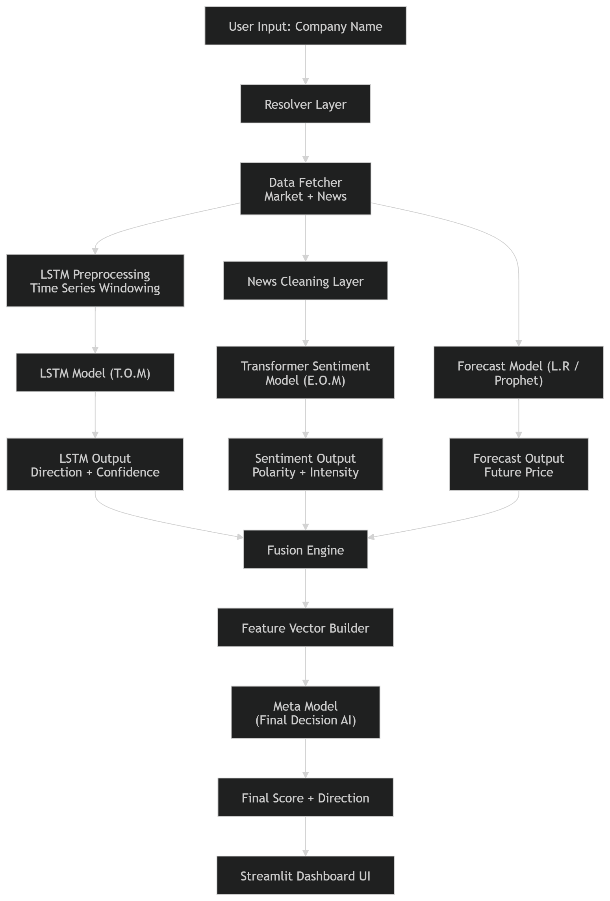

# R.A.I.S
# Custom Financial Intelligence System

A multi-brain AI architecture for stock analysis and financial forecasting using:

- LSTM Deep Learning
- Transformer-based Sentiment Analysis
- Prophet Forecasting
- Meta-Learning Fusion Engine

The system combines market behavior, financial news sentiment, and long-term forecasting into a unified AI decision pipeline.

---

# Architecture



---

# Overview

Traditional stock prediction systems usually rely on a single model.

This project introduces a **multi-model financial intelligence framework** inspired by distributed reasoning systems.

The system operates using three independent AI “brains”:

| Brain | Purpose |
|---|---|
| LSTM Brain (T.O.M) | Learns short-term market movement patterns |
| Emotion AI (E.O.M) | Understands market sentiment from financial news |
| Forecast Brain (L.R / Prophet) | Predicts long-term statistical trends |

These outputs are fused together and passed into a **Meta Decision AI** which produces the final market score and direction.

---

# Core Features

## Real-Time Market Analysis
- Fetches live stock data using Yahoo Finance
- Fetches real-time business news using NewsData API

## Deep Learning Time-Series Brain
- LSTM-based forecasting system
- Multi-head architecture:
  - Price prediction
  - Return estimation
  - Direction confidence

## Transformer Sentiment Brain
- Transformer-based NLP sentiment model
- Financial news polarity detection
- Confidence-weighted emotional intensity scoring

## Prophet Forecast Brain
- Long-term trend forecasting
- Statistical future price estimation
- Direction and strength analysis

## Fusion Engine
Combines:
- Technical signals
- Emotional sentiment
- Forecast intelligence

into a unified feature representation.

## Meta Decision AI
A RandomForest meta-model trained on:
- LSTM outputs
- Sentiment outputs
- Prophet outputs

to produce the final investment signal.

---

# System Workflow

```text
User Input
   ↓
Resolver Layer
   ↓
Market + News Fetcher
   ↓
 ┌────────────────────────────────────┐
 │           Parallel Brains          │
 ├────────────────────────────────────┤
 │ LSTM Time-Series Brain             │
 │ Transformer Sentiment Brain        │
 │ Prophet Forecast Brain             │
 └────────────────────────────────────┘
   ↓
Fusion Engine
   ↓
Feature Vector Builder
   ↓
Meta Decision AI
   ↓
Final Score + Direction
```

---

# Technologies Used

## AI / ML
- PyTorch
- Transformers
- Scikit-learn
- Prophet

## Data
- Yahoo Finance API
- NewsData API

## Visualization
- Matplotlib
- Streamlit / Flask Dashboard

---

# Project Structure

```text
AI-LAB-PROJECT/
│
├── app.py
├── main.py
├── utility.py
├── infer_fus.py
│
├── lstm.py
├── Sentiment.py
├── lr.py
├── meta_brain.py
│
├── meta_dataset.py
├── meta_train.py
│
├── lstm_model/
├── sen_model/
│
├── static/
├── templates/
│
└── assets/
    └── architecture.png
```

---

# Installation

## 1. Clone Repository

```bash
git clone https://github.com/YOUR_USERNAME/YOUR_REPOSITORY.git

cd YOUR_REPOSITORY
```

---

## 2. Install Requirements

```bash
pip install -r requirements.txt
```

---

# Required Libraries

```txt
torch
transformers
scikit-learn
prophet
yfinance
pandas
numpy
matplotlib
flask
streamlit
joblib
requests
```

---

# Running the System

## Console Mode

```bash
python main.py
```

---

## Flask Dashboard

```bash
python app.py
```

Then open:

```text
http://127.0.0.1:5000
```

---

# Example Output

```python
{
 'ticker': 'AAPL',

 'lstm': {
    'direction': 0.52,
    'confidence': 0.52
 },

 'sentiment': {
    'sentiment_signal': 0.09
 },

 'prophet': {
    'future_price': 316.7
 },

 'meta_score': 0.00046
}
```

---

# Research Objective

This project explores:

- Hybrid AI architectures for financial intelligence
- Ensemble learning systems
- Multi-modal market reasoning
- AI-assisted decision systems
- Fusion of NLP + Time-Series Forecasting

---

# Real-World Applications

- Financial market analysis
- Investment assistance systems
- AI-powered trading research
- Economic trend analysis
- Decision support systems

---

# Future Improvements

- Reinforcement learning portfolio agent
- Multi-stock portfolio reasoning
- Attention-based fusion engine
- Real-time websocket market streams
- GPU inference optimization
- Advanced dashboard visualization
- Explainable AI decision tracing

---

# Team Vision

The goal of this project is not only stock prediction, but building a modular financial intelligence framework capable of combining multiple reasoning systems into one unified decision architecture.


# License

MIT License
